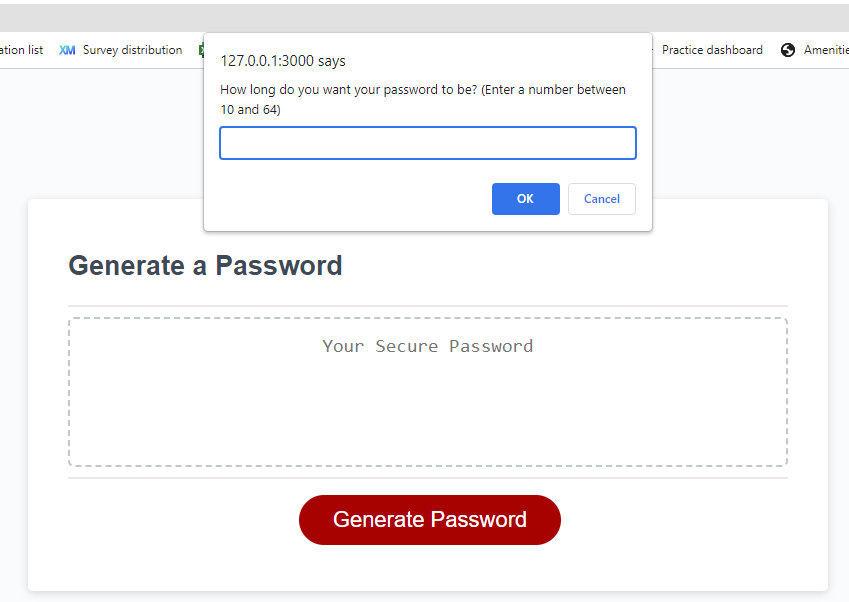
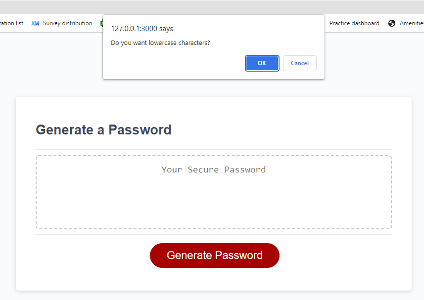
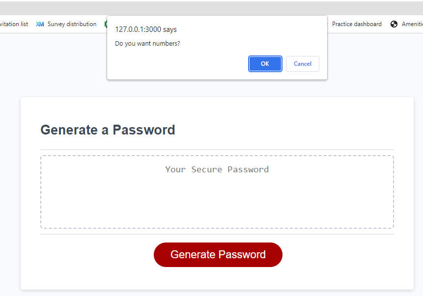
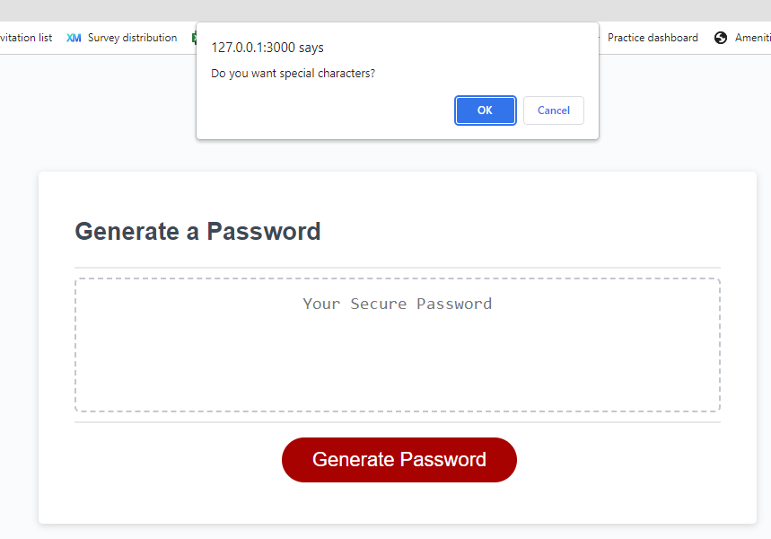
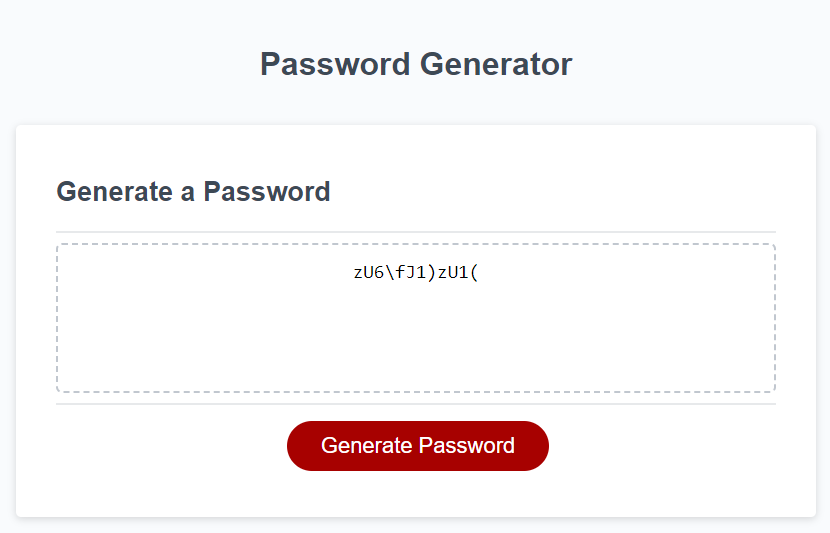

# password-generator
A password generator project with a simple UI as part of the front end development bootcamp

## Description

This website houses a JavaScript programme which generates a random password based on user input. The resulting password follows a pattern based on the user inputs, eg if the user says they want lowercase, uppercase and numbers only, the password will follow the format xXnxXn.

The project helped me learn how to run multiple functions and reuse user inputs from one function across multiple functions. It also taught me how to break down a larger task into smaller steps and to apply coding logic to work out how to programme it.

The project is deployed to GitHub pages, at: https://merrims.github.io/password-generator/

## Usage

The site displays a simple user interface with a button which opens a number of options then generates a password when clicked

Password length option:

Lowercase characters option:

Numbers option:

Special characters option:

When options have been selected, a random password is generated in the "your secure password" box. In this example, I chose 12 characters and all possible options:

## Credits

I also used StackExchange on many occasions for ideas when debugging specific issues: https://stackoverflow.com/

I referred to W3Schools for clarification on some concepts: https://www.w3schools.com/js/

The HTML and CSS was provided in the activity starter code.

## License

MIT Licence